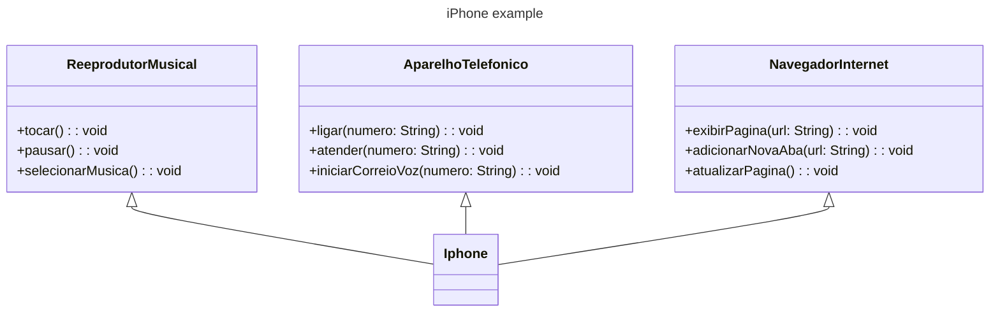

# POO - Desafio

Diagramação de classes iPhone para o Desafio da [DIO](https://web.dio.me/home).

## UML

```mermaid
---
title: iPhone example
---
classDiagram
    ReeprodutorMusical <|-- Iphone
    AparelhoTelefonico <|-- Iphone
    NavegadorInternet <|-- Iphone
    
    class Iphone{
    }
    
    class ReeprodutorMusical{
        +tocar(): void
        +pausar(): void
        +selecionarMusica(): void
    }
    
    class AparelhoTelefonico{
        +ligar(numero: String): void
        +atender(numero: String): void
        +iniciarCorreioVoz(numero: String): void
    }
    
    class NavegadorInternet{
        +exibirPagina(url: String): void
        +adicionarNovaAba(url: String): void
        +atualizarPagina(): void
    }
```